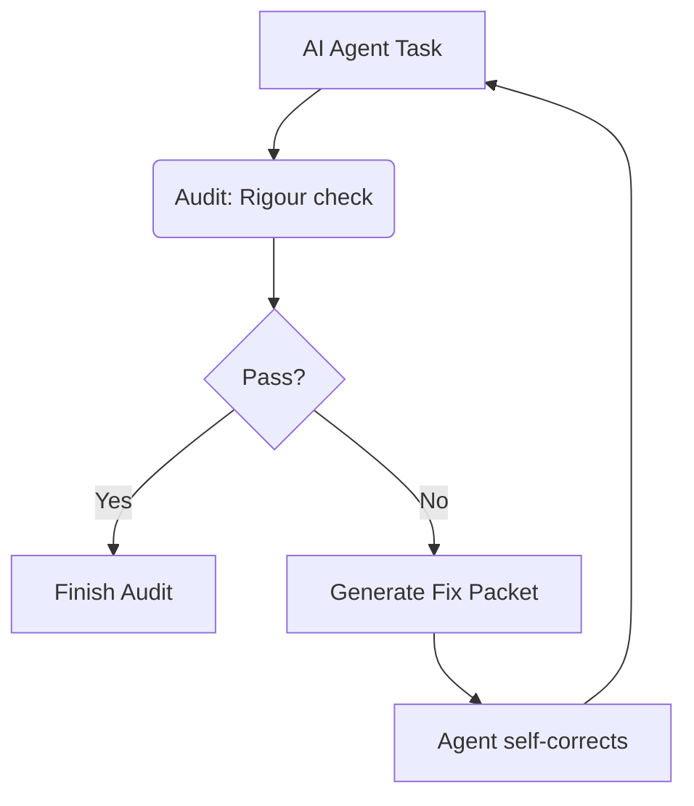

# Philosophy

The no-bullshit approach to AI code review.

## The Problem

AI coding agents are powerful, but they can also be dangerous. They might:

- Modify files they shouldn't touch
- Introduce security vulnerabilities
- Make changes that break your build
- Touch too many files at once

## The Rigour Solution

Rigour acts as a **safety layer** between AI agents and your codebase. It validates every change before it's applied.

### Core Principles

#### 1. Trust, But Verify

AI agents are helpful. But every change should be validated before it touches production code.

#### 2. Fail Fast

Catch problems immediately, not after code is merged.

#### 3. Zero Config by Default

Rigour works out of the box with sensible defaults. Configure only what you need.

#### 4. Transparency

Every validation result includes clear explanations. No black boxes.

## How It Works

1. **Initial Pass**: Your agent (CLI or IDE-based) proposes changes.
2. **Audit**: Rigour runs internal gates (AST, Safety, Content) and external commands (Tests, Lint).
3. **Diagnostic**: If gates fail, Rigour generates a structured **Fix Packet** (JSON-based engineering feedback).
4. **Self-Correction**: The agent consumes the Fix Packet to correct its own violations automatically.

## No Bullshit Means

- **No telemetry** - Your code stays private
- **No cloud dependency** - Runs entirely local
- **No complex setup** - One command to start
- **No false promises** - We catch what we can, honestly
