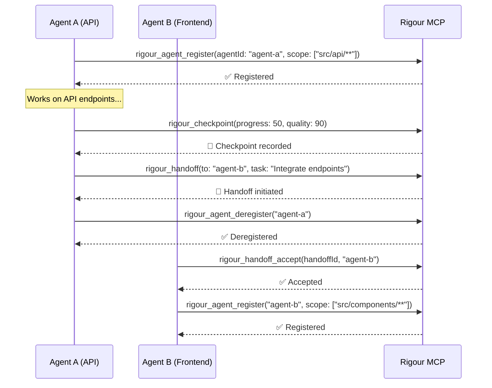

# Frontier Model Tools

Rigour v2.14+ includes specialized MCP tools designed for next-generation AI models like **Claude Opus 4.6** and **GPT-5.3-Codex** that support:

- **Multi-agent collaboration** - Multiple AI agents working on the same codebase
- **Long-running sessions** - Extended coding sessions (hours/days)
- **Quality checkpointing** - Periodic quality assessments with drift detection

## Tool Overview

| Tool | Purpose | Key Feature |
|:-----|:--------|:------------|
| `rigour_agent_register` | Register agent in session | Scope conflict detection |
| `rigour_agent_deregister` | Remove agent from session | Clean session management |
| `rigour_checkpoint` | Record quality checkpoint | Drift detection |
| `rigour_handoff` | Initiate task handoff | Multi-agent coordination |
| `rigour_handoff_accept` | Accept pending handoff | Verified handoff flow |

---

## rigour_agent_register

Register an agent at the START of execution to claim task scope and enable cross-agent conflict detection.

### Parameters

| Parameter | Type | Required | Description |
|:----------|:-----|:---------|:------------|
| `cwd` | string | ✅ | Absolute path to project root |
| `agentId` | string | ✅ | Unique identifier (e.g., `agent-frontend`) |
| `taskScope` | string[] | ✅ | Glob patterns for claimed files |

### Example

```json
{
  "cwd": "/path/to/project",
  "agentId": "opus-api-agent",
  "taskScope": ["src/api/**", "tests/api/**"]
}
```

### Response

```
✅ AGENT REGISTERED: "opus-api-agent" claimed scope: src/api/**, tests/api/**

Active agents in session: 1
```

### Conflict Detection

If another agent already claims overlapping scope:

```
⚠️ SCOPE CONFLICTS DETECTED:
  - opus-frontend-agent also claims "src/shared/**"

Consider coordinating with other agents or narrowing your scope.
```

---

## rigour_agent_deregister

Remove an agent from the session when work is complete or scope needs to be released.

### Parameters

| Parameter | Type | Required | Description |
|:----------|:-----|:---------|:------------|
| `cwd` | string | ✅ | Absolute path to project root |
| `agentId` | string | ✅ | ID of agent to deregister |

### Example

```json
{
  "cwd": "/path/to/project",
  "agentId": "opus-api-agent"
}
```

---

## rigour_checkpoint

Record a quality checkpoint during long-running sessions. Call every 15-30 minutes to enable drift detection and quality monitoring.

### Parameters

| Parameter | Type | Required | Description |
|:----------|:-----|:---------|:------------|
| `cwd` | string | ✅ | Absolute path to project root |
| `progressPct` | number | ✅ | Estimated progress (0-100) |
| `summary` | string | ✅ | Brief description of recent work |
| `qualityScore` | number | ✅ | Self-assessed quality (0-100) |
| `filesChanged` | string[] | ❌ | List of modified files |

### Example

```json
{
  "cwd": "/path/to/project",
  "progressPct": 45,
  "summary": "Implemented user authentication endpoints",
  "qualityScore": 88,
  "filesChanged": ["src/api/auth.ts", "tests/auth.test.ts"]
}
```

### Quality Warnings

The checkpoint system provides warnings when:

1. **Quality Below Threshold** (< 80%):
   ```
   ⚠️ Quality score 65% is below threshold 80%
   ⛔ QUALITY BELOW THRESHOLD: Consider pausing and reviewing recent work.
   ```

2. **Drift Detected** (quality degrading over time):
   ```
   ⚠️ Drift detected: quality dropped from avg 88% to 70%
   ```

---

## rigour_handoff

Initiate a task handoff to another agent. Use when delegating a subtask or completing your scope.

### Parameters

| Parameter | Type | Required | Description |
|:----------|:-----|:---------|:------------|
| `cwd` | string | ✅ | Absolute path to project root |
| `fromAgentId` | string | ✅ | ID of initiating agent |
| `toAgentId` | string | ✅ | ID of receiving agent |
| `taskDescription` | string | ✅ | Description of the task |
| `filesInScope` | string[] | ❌ | Relevant files |
| `context` | string | ❌ | Additional context |

### Example

```json
{
  "cwd": "/path/to/project",
  "fromAgentId": "opus-api-agent",
  "toAgentId": "opus-frontend-agent",
  "taskDescription": "Integrate the new auth endpoints with the login form",
  "filesInScope": ["src/api/auth.ts", "src/components/LoginForm.tsx"],
  "context": "Auth endpoints return JWT tokens in the response body"
}
```

---

## rigour_handoff_accept

Accept a pending handoff. This verifies you are the intended recipient.

### Parameters

| Parameter | Type | Required | Description |
|:----------|:-----|:---------|:------------|
| `cwd` | string | ✅ | Absolute path to project root |
| `handoffId` | string | ✅ | ID of the handoff to accept |
| `agentId` | string | ✅ | Your agent ID (must match `toAgentId`) |

### Example

```json
{
  "cwd": "/path/to/project",
  "handoffId": "handoff-1707234567890",
  "agentId": "opus-frontend-agent"
}
```

---

## Multi-Agent Workflow Example



---

## Best Practices

1. **Always register first** - Call `rigour_agent_register` at session start
2. **Checkpoint regularly** - Every 15-30 minutes for long sessions
3. **Be honest with quality scores** - Artificially high scores trigger drift detection
4. **Narrow your scope** - Claim only files you'll actually modify
5. **Complete the handoff flow** - Use `handoff_accept` before claiming scope
6. **Deregister when done** - Release scope for other agents
