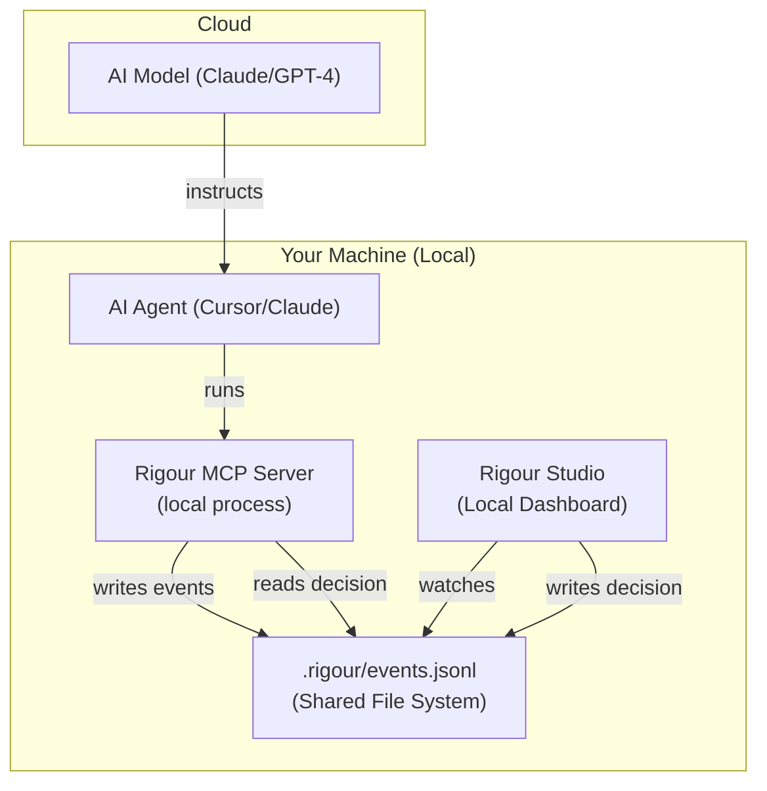

# MCP Server

Connect Rigour directly to your AI agents (Cursor, Claude Code, etc.) to enforce quality standards in real-time.

---

## ⚡ Quick Start

```bash
npx -y @rigour-labs/mcp
```

---

## 🔌 Integration Recipes

### 🤖 Claude Code
```bash
claude mcp add rigour npx -y @rigour-labs/mcp
```

### 🖱️ Cursor
1. Go to **Settings > Features > MCP**.
2. **+ Add New MCP Server**:
   - **Name**: `Rigour`
   - **Type**: `command`
   - **Command**: `npx -y @rigour-labs/mcp`

### 🛠️ Cline / Roo Code
Add this to your `cline_mcp_settings.json`:
```json
{
  "mcpServers": {
    "rigour": {
      "command": "npx",
      "args": ["-y", "@rigour-labs/mcp"]
    }
  }
}
```

---

## 🛠️ Essential Tools

Once connected, your AI agent will automatically use these tools:

| Tool | Purpose |
|:---|:---|
| `rigour_check` | Runs all quality gates on your code. |
| `rigour_run` | **Interceptable** command execution (e.g., tests, deploys). |
| `rigour_find_patterns` | Semantic search for codebase patterns. |
| `rigour_remember` | Persist architectural decisions in memory. |
| `rigour_recall` | Retrieve stored engineering context. |
| `rigour_get_fix_packet` | Get precise refactoring instructions on failure. |

---

## 🏗️ How it Works: The Local Bridge

Even if your AI agent (like Cursor or Claude Code) is communicating with a model in the cloud, the **Governance Interception** happens entirely on your local machine.

### The Handshake Architecture



### The Synchronization Flow:
1. **Local Spawn**: When you add the Rigour MCP to your IDE, the IDE launches the server as a **local process** on your machine.
2. **Shared State**: Both the MCP server and the Studio UI point to the same `.rigour` folder in your project root.
3. **Air-Gapped Arbitration**: 
   - The MCP server writes an "interception requested" log.
   - The Studio UI (via EventStream) detects this change instantly and pauses the agent.
   - Your local decision (Approve/Reject) is written back to the log.
   - The local MCP server sees your decision and returns the result to the AI agent.

*This ensures that your governance is local, private, and instantaneous—no matter where the AI model is hosted.*

### 🌐 Local vs. Hosted Interception

| Component | Local Bridge (Current) | Hosted Bridge (mcp.rigour.run) |
|:---|:---|:---|
| **MCP Execution** | NPX Command on your laptop. | SSE/HTTPS URL (Hosted). |
| **Sync Layer** | Local `.rigour/` folder. | Rigour Cloud API (Websockets). |
| **Command Scope** | Runs local scripts (`npm test`). | Runs remote scripts (CI/CD). |
| **Interception** | Studio watches local disk. | Studio connects to Cloud Stream. |

> [!NOTE]
> **Why Hosted Interception?**  
> If you are using a hosted MCP server (e.g., `https://mcp.rigour.run`), the interception events are pushed to the Rigour Governance Cloud. Your local Studio UI can "subscribe" to your Project ID to arbitrate these remote actions.

---

## 💡 Pro Tip
Always keep the [Rigour Studio](/concepts/governance-studio) open on a second monitor while working with MCP agents. It provides a visual audit trail of everything the agent is doing.
