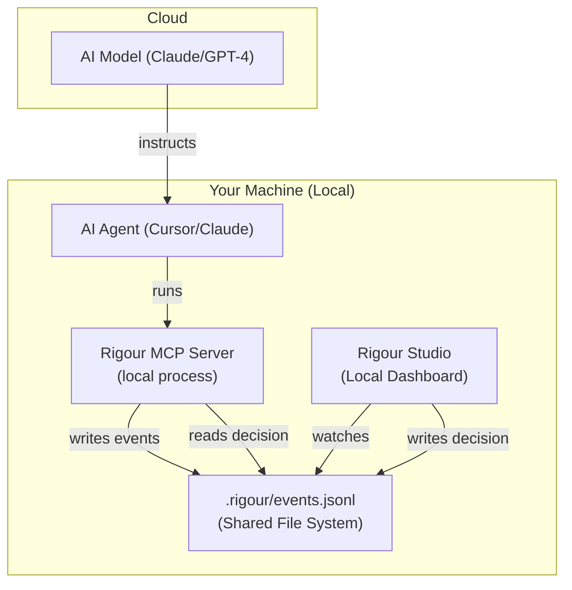

# MCP Server

Connect Rigour directly to your AI agents (Cursor, Claude Code, etc.) to enforce quality standards in real-time.

---

## ⚡ Quick Start

```bash
npx -y @rigour-labs/mcp
```

---

## 🔌 Integration Recipes

### 🤖 Claude Code (CLI)
```bash
claude mcp add rigour -- npx -y @rigour-labs/mcp
```

### 🖱️ Cursor
1. Go to **Settings > Features > MCP**.
2. **+ Add New MCP Server**:
   - **Name**: `Rigour`
   - **Type**: `command`
   - **Command**: `npx -y @rigour-labs/mcp`

### 🛠️ Cline / Roo Code
Add this to your `cline_mcp_settings.json`:
```json
{
  "mcpServers": {
    "rigour": {
      "command": "npx",
      "args": ["-y", "@rigour-labs/mcp"]
    }
  }
}
```

---

## 🛠️ Essential Tools

Once connected, your AI agent will automatically use these tools:

| Tool | Purpose |
|:---|:---|
| `rigour_check` | Runs all quality gates on your code. |
| `rigour_run` | **Interceptable** command execution (e.g., tests, deploys). |
| `rigour_run_supervised` | **Full Supervisor Mode** - iterative loop until gates pass. |
| `rigour_find_patterns` | Semantic search for codebase patterns. |
| `rigour_remember` | Persist architectural decisions in memory. |
| `rigour_recall` | Retrieve stored engineering context. |
| `rigour_get_fix_packet` | Get precise refactoring instructions on failure. |

### New Tools (v2.14+ – Frontier Model Support)

These tools enable supervision of Opus 4.6 agent teams and GPT-5.3 coworking mode:

| Tool | Purpose |
|:---|:---|
| `rigour_checkpoint` | Report checkpoint status during long-running tasks. |
| `rigour_agent_register` | Register an agent in a multi-agent team session. |
| `rigour_security_patterns` | Pre-commit security pattern check. |

```typescript
// Agent team example
await mcp.call("rigour_agent_register", {
  cwd: "/project",
  agent_id: "agent-frontend",
  task_scope: ["src/ui/**", "src/components/**"]
});

// Checkpoint during long task
await mcp.call("rigour_checkpoint", {
  cwd: "/project",
  progress_pct: 50,
  files_changed: ["src/api/users.ts"],
  summary: "Implemented user endpoints"
});
```

### `rigour_run_supervised`
Implements the full **Supervisor Mode** via MCP. Iteratively runs your agent command, checks gates, and provides fix packets until PASS or max retries.

```typescript
// Example MCP call
rigour_run_supervised({
  cwd: "/path/to/project",
  command: "claude \"fix the auth bug\"",
  maxRetries: 3,  // default: 3
  dryRun: false   // skip command execution for testing
})
```

---

## 🏗️ How it Works: The Local Bridge

Even if your AI agent (like Cursor or Claude Code) is communicating with a model in the cloud, the **Governance Interception** happens entirely on your local machine.

### The Handshake Architecture



### The Synchronization Flow:
1. **Local Spawn**: When you add the Rigour MCP to your IDE, the IDE launches the server as a **local process** on your machine.
2. **Shared State**: Both the MCP server and the Studio UI point to the same `.rigour` folder in your project root.
3. **Air-Gapped Arbitration**: 
   - The MCP server writes an "interception requested" log.
   - The Studio UI (via EventStream) detects this change instantly and pauses the agent.
   - Your local decision (Approve/Reject) is written back to the log.
   - The local MCP server sees your decision and returns the result to the AI agent.

### 🛡️ Zero-Telemetry & Local Trust

Rigour is intentionally **local-first**. Unlike other governance tools that require cloud connectivity, Rigour's interception layer is built on a "Local Bridge" architecture:

- **Local Storage**: All interception logs and human decisions are stored only in your `.rigour/` folder.
- **Air-Gapped Sync**: The synchronization between your AI agent and the Governance Studio happens entirely on your machine via the local filesystem.
- **Zero Push**: We never push your source code, your command history, or your arbitration decisions to any external server.

*This ensures that your project's engineering standards and command executions remain 100% private and under your total control.*

## 🌐 Web vs. Desktop: The Governance Moat

| Feature | Desktop (Cursor / Claude Desktop) | Web (Claude.ai / ChatGPT) |
|:---|:---|:---|
| **File Access** | ✅ Native (direct disk read/write) | ❌ Sandboxed (no local disk access) |
| **Trust Model** | 🛡️ **Local Honest** (100% Private) | ☁️ Cloud-Mediated (requires tunnel) |
| **Setup** | `npx @rigour-labs/mcp` | Hosted Connector + Tunnel |

### Why doesn't the Web App see my local files?
For security, your browser cannot run shell commands or read your hard drive. To bridge Rigour to a web app, you would need to use a **Secure Tunnel** (like `ngrok`) to expose a local SSE server. 

> [!IMPORTANT]
> To maintain the **Local Honest** moat, we recommend using Rigour with **Desktop AI Agents**. If you must use the web version, look into our [Remote MCP Server](/mcp/remote-mcp-server) for the E2E-encrypted connectivity.

---

## 💡 Pro Tip
Always keep the [Rigour Studio](/concepts/governance-studio) open on a second monitor while working with MCP agents. It provides a visual audit trail of everything the agent is doing.
